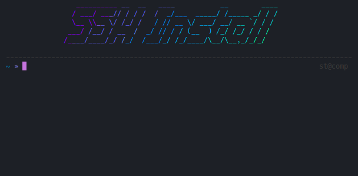

# Установка и настройка ssh



## Установка клиент - сервер

```bash
sudo pacman -S openssh
```

На сервере запустить и включить сервис в автостарт.

```bash
sudo systemctl start sshd
sudo systemctl enable sshd
```

## Настройка на клиенте

### Генерация ключей

```bash
ssh-keygen -t rsa -b 4096 -C "ctlos@protonmail.com"
```

Ключи упадут в `~/.ssh`.

### Отправка ключа на сервер

```bash
ssh-copy-id username@remote_host
```

Или так. Копируем ключ на сервер.

```bash
cat .ssh/id_rsa.pub | ssh dj2@192.168.1.35 'mkdir -p ~/.ssh && cat >> .ssh/authorized_keys'
```

### Настройка конфига на клиенте

```bash
nano ~/.ssh/config
```

Подгоняем конфиг под конкретный сервер. Комментарии не учитываются `#`. Хостов может быть сколько угодно, какждый - сервер.

```bash
Host *
    #ForwardAgent yes
    #ForwardX11 yes
    #ForwardX11Trusted yes

Host dj
    ForwardAgent yes
    ForwardX11 yes
    ForwardX11Trusted yes
    HostName 198.157.18.18
    Port 223
    User dj2
```

Блок с `Host *` задает глобальные настройки для всех серверов.

Данный блок с `Host dj` конкретно под сервер.

- Host: может быть любой, для вашего удобства.
- Строки c `Forward`: включаем X11Forwarding.
- Дальше ip, port, user (понятно).

## Настройка на сервере

Файл конфигурации тут: `/etc/ssh/sshd_config`.

Запрещаем авторизацию от `root`, можно не править, по умолчанию так.

```bash
PermitRootLogin no
```

Если правим, то укажем кому можно.

```bash
AllowUsers dj2 bob
```

Отключение авторизации по паролю.

```bash
PasswordAuthentication no
```

Укажем в конфиге файл авторизации.

```bash
AuthorizedKeysFile  .ssh/authorized_keys
```

Права как на клиенте так и на сервере.

```bash
chmod 700 ~/.ssh
chmod 600 ~/.ssh/*
chown -R $USER ~/.ssh
```

Перезапустить сервис.

```bash
sudo systemctl restart sshd
```

### X11Forwarding на сервере

Снять комментарии и привести строки в вид, в файле `/etc/ssh/sshd_config`.

```bash
X11Forwarding yes
X11DisplayOffset 10
X11UseLocalhost no
```

Перезапустить сервис.

```bash
sudo systemctl restart sshd
```

При запуске через sudo, если ошибка `cannot open display: xxx-xx:10.0` нужно скопировать файл авторизации в `/root`.

```bash
sudo cp ~user_name/.Xauthority ~root/.Xauthority
```
